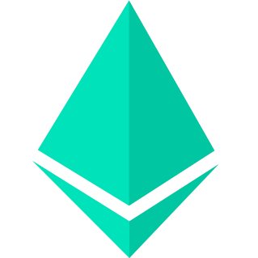

<div align="center">
  
</div>
<div align="center">
  <h1>Fragment UI (Work in Progress)</h1>
  <p>Create SaaS UIs with a simple and straightforward design system and component library</p>
  <a href="https://www.npmjs.org/package/@fragment-build/ui">
    
  </a>
  <a href="https://fragment-build.github.io/fragment-ui/">
    
  </a>
</div>
<div align="center" style="margin: 20px">
  <a href="https://discord.gg/A4GrRkgpym">
    
  </a>
</div>

---

Fragment UI is a design system and React component library which provides already compositioned views for many SaaS apps which are completely customizable with our powerful theme system.

### Table of Contents
- [✨ Features](#-features)
- [✨ Components](#-components)
- [⏳ Installation](#-installation)
- [🔧 Configuration](#-configuration)
  - [Next.js 13+](#nextjs-13)
- [🤝 Contributing](#-contributing)
- [👨‍💻 Development](#-development)
- [🤝 Community support](#-community-support)
- [📝 License](#-license)
- [🔧 Built with](#-built-with)

## ✨ Features

- **Global theme file** with design tokens for colors, padding, margin, border-radius
- **Global event system:** Hook into every click event to trigger analytics/tracking events. All events are already pre-labeled but can be customized.
- **Accessibility:** All components are already prepared using aria labels and you can also easily use tab to navigate through them
- **Light / Dark mode compatible:** By design we're supporting ☀️ Light / 🌙 Dark modes
- **Interactive Theme Builder (soon):** A user interface to create your custom theme file with a real-time preview
- **Native i18n support (soon):** All components are localized by default but o course you can override this behavior

## ✨ Components

- Roles- & Permission Management
- User Management
- Team/Organization management with Invites
- Payment/Subscription Management
- Auth pages: Login, Signup, Password reset, Email confirmation
- Dashboard View with Sidebar and Topbar
- User Settings

## ⏳ Installation

1. Setup Tailwind CSS  
[Installation Guide](https://tailwindcss.com/docs/installation)

2. Install Fragment UI
```bash
npm install -S @fragment-build/ui
```

As a next step you must configure the library the way you want to. See [**Configuration**](#🔧-configuration) section.

All done. Enjoy 🎉

## 🔧 Configuration

```ts
// tailwind.config.ts

import type { Config } from 'tailwindcss';
import { fragmentui, nextui } from '@fragment-build/ui';

const config: Config = {
  content: [
    './src/**/*.{js,jsx,ts,tsx}',
    './node_modules/@nextui-org/theme/dist/**/*.{js,ts,jsx,tsx}',
    './node_modules/@fragment-build/ui/dist/**/*.{js,ts,jsx,tsx}',
  ],
  darkMode: 'class',
  plugins: [
    fragmentui(),
    nextui(),
  ],
};

export default config;
```

It is essential to add the FragmentUIProvider at the root of your application.

```ts
import React from "react";

// 1. import `FragmentUIProvider` component
import { FragmentUIProvider } from "@fragment-build/ui";

function App() {
  // 2. Wrap FragmentUIProvider at the root of your app
  return (
    <FragmentUIProvider>
      <YourApplication />
    </FragmentUIProvider>
  );
}
```

### Next.js 13+

When using Next.js you will need to add a file to re-export Fragment UI using `'use client';` to tell Next.js to render them as client components.

```ts
'use client';

export * from '@fragment-build/ui';
```

Now just import all the components you need from this file.

## 🤝 Contributing

Feel free to fork and make a Pull Request to this project. All the input is warmly welcome!

To increase the amount of PRs being merged asap, we have some guidelines:

1. **Bugfixes**: If it's just a small fix you can just create a PR for it and explain your thoughts if necessary, otherwise use GitHub or Discord to start a discussion before you put a lot of effort into code changes.
2. **Features**: If you want to add new features, please use GitHub or Discord to start a discussion and we can figure out design and architectural decisions together.
3. **Breaking Changes**: Please use the `next-major` branch as your base and target branch for your contributions.


## 👨‍💻 Development
- Clone repository

    ```bash
    git clone git@github.com:fragment-build/fragment-ui.git
    cd fragment-ui
    npm install
    ```

- Run storybook

    ```bash
    npm run storybook
    ```

## 🤝 Community support

For additional help, you can use one of these channels to ask a question:

- [Discord](https://discord.gg/A4GrRkgpym) We're present on official Fragment UI Discord. Feel free to use our channels or reach out to us directly.
- [GitHub](https://github.com/fragment-build/fragment-ui) (Bug reports, Contributions, Questions and Discussions)

## 📝 License

[Apollo 2.0 License](LICENSE.md) Copyright (c) solyd GmbH

## 🔧 Built with


